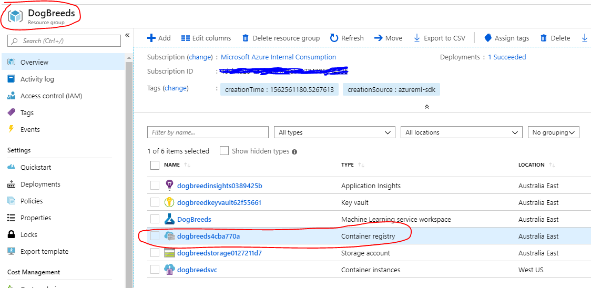
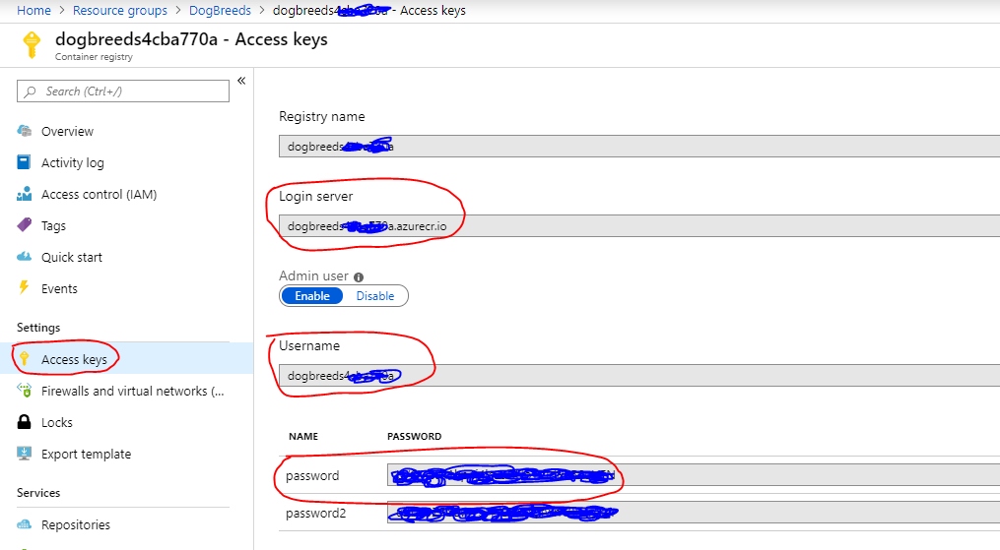
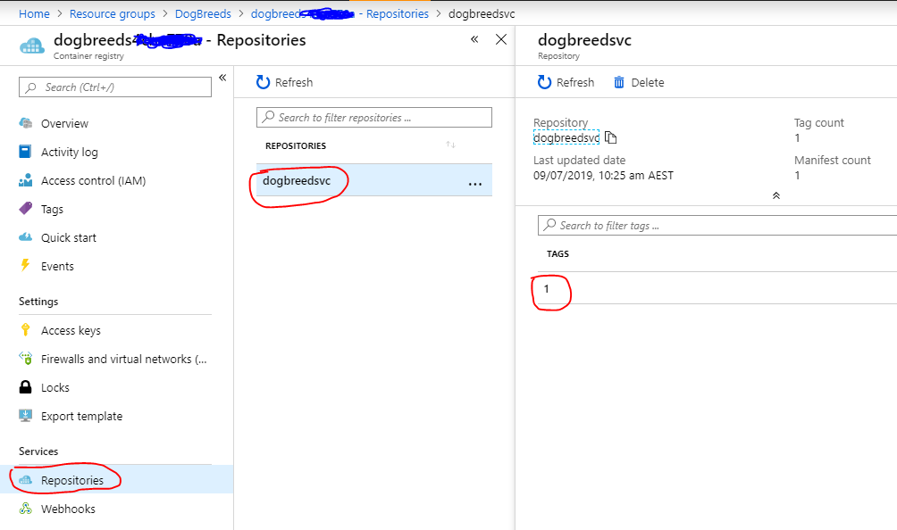

# MLOps Guide - operationalising our machine learning process

## Introduction

Part 2 of this workshop will focus on operationalising our ML model via CI/CD pipelines so that we have an end-to-end, automated, repeatable process.  Much of this process is described in the [MLOps with Azure ML](https://github.com/microsoft/MLOpsPython) GitHub repository.  We'll use this approach as a basis for our workshop and you can refer to the source code in thast repo for hints.

## (Optional) Test our Docker Image ML model locally

If you have [Docker Desktop](https://www.docker.com/products/docker-desktop) installed locally (or if you have access to an Azure VM with [Docker Engine](https://azure.microsoft.com/en-au/resources/templates/docker-simple-on-ubuntu/) installed) then you can directly test the digbreeds ML model via the package Docker image artefact created in Part 1.

### Retrieve your Docker credentials from ACR

From the Azure Portal, access the `DogBreeds` Resource Group you created created in Part 1.

Select the Container Registry resource which containers your Docker Image ML models.



Select **Settings** / **Access keys**  to retrieve the Docker credentials needed to login to your Azure Container Registry from the commandline.



### Pull the Docker image locally

Login to your Azure Container Registry:

```sh
docker login <login-server> -u <username> -p <password>
```

Verify the container image repository name and version from the **Services** / **Repositories** menu:



**Note**: The Azure ML service created the Container Registry for you when you created your first Docker image (`WebService.deploy_from_model`).

Pull the model image from the container registry:

```sh
docker pull <login-server>/dobgreeds:1
```

Output:
```
1: Pulling from dogbreedsvc
9ff7e2e5f967: Already exists
59856638ac9f: Already exists
...snip...
42ac7d80edd4: Pull complete
Digest: sha256:7e5fbdbc3a3511530e3e767bf2a363f6887705496540813d2b0ffdb37accd274
Status: Downloaded newer image for dogbreedsXXXXXXXXXX.azurecr.io/dogbreedsvc:1
```

### Run the container locally

```sh
docker run -d --name dogbreedsvc -p 5001:5001 dogbreedsXXXXXXXXXX.azurecr.io/dogbreedsvc:1
```

Verify the container has started:

```sh
docker container ls
```

Output:

```
CONTAINER ID        IMAGE                                        COMMAND                 CREATED             STATUS              PORTS                              NAMES
b08964681242        dogbreedsXXXXXXXXXX.azurecr.io/dogbreedsvc:1   "runsvdir /var/runit"   40 seconds ago      Up 38 seconds       0.0.0.0:5001->5001/tcp, 8883/tcp   dogbreedsvc
```

The dogbreed ML service should be `Healthy`:

```sh
curl localhost:5001                                                                             # ==> Healthy
```

Now test the model by posting a dog image to the endpoint (assumes a `Bash` shell):

```sh
cd <GBB-MLOps-Workshop-dir>
(echo -n '{"data": "'; base64 breeds-10/val/n02091032-Italian_greyhound/n02091032_2687.jpg; echo '"}') | curl -sX POST -H "Content-Type: application/json" -d @-  http://localhost:5001/score

# ==> "{\"label\": \"Italian_greyhound\", \"probability\": \"0.5147553\"}"
```

### Stop and remove running Docker container

```sh
docker rm -f dogbreedsvc
```

## Creating our AKS cluster

Azure ML service supports [creation of an AKS cluster](https://docs.microsoft.com/en-us/azure/machine-learning/service/how-to-deploy-and-where#create-a-new-aks-cluster) via the [Azure Machine Learning SDK for Python](https://docs.microsoft.com/en-us/python/api/overview/azure/ml/intro).

For Dev-Test clusters, you can create the cluster using the Azure ML SDK for Python (see: [example code](https://github.com/Azure/MachineLearningNotebooks/blob/master/how-to-use-azureml/deployment/production-deploy-to-aks/production-deploy-to-aks.ipynb)).

However, in a typical production environment, the cluster would already exist and would have been provisioned and security hardened by an infrastructure or ops team.

Creation of a AKS cluster can therefore be achieved through ARM Templates, Terraform, PowerShell scripts, Azure CLI or even the Azure Portal.

For the purposes of this workshop, we'll create an AKS cluster using the Azure CLI and then [attach to the cluster](https://docs.microsoft.com/en-us/azure/machine-learning/service/how-to-deploy-and-where#attach-an-existing-aks-cluster) in our Python code.

### Azure CLI local setup

Complete these steps:

* [Install the Azure CLI](https://docs.microsoft.com/en-us/cli/azure/install-azure-cli)
* [Sign in interactively](https://docs.microsoft.com/en-us/cli/azure/authenticate-azure-cli?view=azure-cli-latest#sign-in-interactively)

### Azure Cloud Shell

You can use the [Azure Cloud Shell](https://docs.microsoft.com/en-us/azure/cloud-shell/overview) from the Azure Portal if you do not wish to install the Azure CLI locally.  The Azure CouldShell has the Azure CLI and other tools already pre-installed.

### Choose your Azure subscriptions

List your Azure subscriptions:

```sh
az account list
```

Select the subscription you want to use:

```sh
az account set --subscription <id>
```

### Create the AKS cluster (basic networking)

Follow the steps outlined in [Tutorial: Deploy an Azure Kubernetes Service (AKS) cluster](https://docs.microsoft.com/en-us/azure/aks/tutorial-kubernetes-deploy-cluster) to create a cluster with basic networking and 3 nodes.

Use this command to create the cluster instead of the one shown in the linked tutorial above.

```sh
az aks create \
    --resource-group DogBreeds \
    --name DogBreeds \
    --node-count 3 \
    --kubernetes-version 1.13.5 \
    --service-principal <appId> \
    --client-secret <password> \
    --generate-ssh-keys \
    --enable-addons monitoring
```

**Note**: Unless you specify a Log Analytics workspace, one will be created for you in a default resource group which may violate your corporate Azure Policy.  In this case, either create or specify an existing workspace with the parameter `--workspace-resource-id` or remove the parameter `--enable-addons monitoring` all together.

### Create the AKS cluster (advanced networking)

## Deploying to AKS

### Using the Azure Machine Learning SDK for Python

You'll need to import existing the AKS cluster definition into your AML workspace so you can deploy models to it.  Hint: see [Attach an existing AKS cluster](https://docs.microsoft.com/en-us/azure/machine-learning/service/how-to-deploy-and-where#attach-an-existing-aks-cluster).

**Note**: attaching the cluster will install some components needed by AML service like a HTTP reverse proxy for TLS termination and API key authentication.

Create a Python script to deploy our model to the AKS cluster.

*Hint*: see [Configure your Azure ML workspace](https://github.com/Azure/MachineLearningNotebooks/blob/master/setup-environment/configuration.ipynb) and [Deploy web service to AKS](https://github.com/Azure/MachineLearningNotebooks/blob/master/how-to-use-azureml/deployment/production-deploy-to-aks/production-deploy-to-aks.ipynb#Deploy-web-service-to-AKS)

**Later, we'll use a code repository (git) to version control our scripts and run from our DevOps pipeline.**

Test the deployed web service works using `curl` or a python script ([hint](https://github.com/Azure/MachineLearningNotebooks/blob/master/how-to-use-azureml/deployment/production-deploy-to-aks/production-deploy-to-aks.ipynb#Test-the-web-service-using-run-method)).

### Using Helm and Ingress Controller

TODO:

* Create Helm chart for model
* Setup Ingress controller for HTTP endpoint
* (Optional) Use an internal LB

### Use `kubectl` to inspect kubernetes objects in AKS

If you followed the [cluster setup](https://docs.microsoft.com/en-us/azure/aks/tutorial-kubernetes-deploy-cluster) steps, you should have `kubectl` configured for your cluster.

Check the deployed `services`, `deployments`, `pods` in the cluster (learn more about [Kubernetes concepts](https://www.youtube.com/watch?v=3I9PkvZ80BQ)).

**Note**: When using the Azure ML to deploy your models, they will be placed in a `namespace` of the format `azureml-<workspace>`, e.g. `azureml-dogbreeds`.

```sh
# hint:
kubectl get svc,deploy, pod -n <namespace>
```

## Create Azure DevOps organization and project

TODO:

* Sign-up for or login to Azure DevOps
* Create your organisation
* Create a project for your DogBreeds code

## Setup Azure Repos

TODO:

* Create a new git repo in Azure Repos for your project
* Extract your Python code into scripts
* Commit and push your files to the git remote

## Setup Azure Pipelines

Use the [MLOps with Azure ML](https://github.com/microsoft/MLOpsPython) code repository as a basis for your solution.  Look at the Python scripts used, build, retraining, and release pipelines.

TODO:

* Setup CI pipeline to create your AML workspace, training cluster and AML pipeline (is using a ML pipeline)
* Setup retraining pipeline (trigger AML pipeline or run local scripts to train on remote AML compute)

### Deploying services using the Azure Machine Learning SDK for Python

TODO:

* Set deployment pipeline with Python scripts to deploy to AKS
* Customise the service deployment parameters (liek CPU, memory, autoscaling, etc.)

### Deploying using Helm

TODO:

* Set deployment pipeline with Helm (deploy to a namespace)

## Scaling our deployed models

TODO:

* Autoscaling via WebService object in Python SDK or HPA with Helm
* Node Autoscaler (requires VMSS in cluster)

## Instrumenting our deployed models

TODO:

* If deploying via Azure ML SDK for Python, turn on Application Insights option for service
* (Optional) Add additional instrumentation to scoring script with Application Insights SDK code

## Extensions

Possible extensions to investigate further:

* Use [Automated ML](https://github.com/Azure/MachineLearningNotebooks/tree/master/how-to-use-azureml/automated-machine-learning) to find best model by automatically adjusting hyperparameters, feature selection, and choice of algorithm.
* Use [HyperDrive](https://docs.microsoft.com/en-us/azure/machine-learning/service/how-to-tune-hyperparameters) tune hyperparameters within a parameter search space
* Use [ML pipelines](https://github.com/Azure/MachineLearningNotebooks/tree/master/how-to-use-azureml/machine-learning-pipelines) to create a training pipeline in Azure ML service

## References

* [MLOps using Azure ML Services and Azure DevOps](https://github.com/microsoft/MLOpsPython)
* [Production Deploy to AKS - Jupyter Notebook](https://github.com/Azure/MachineLearningNotebooks/blob/master/how-to-use-azureml/deployment/production-deploy-to-aks/production-deploy-to-aks.ipynb)
